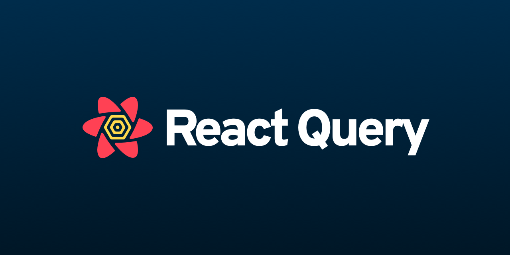
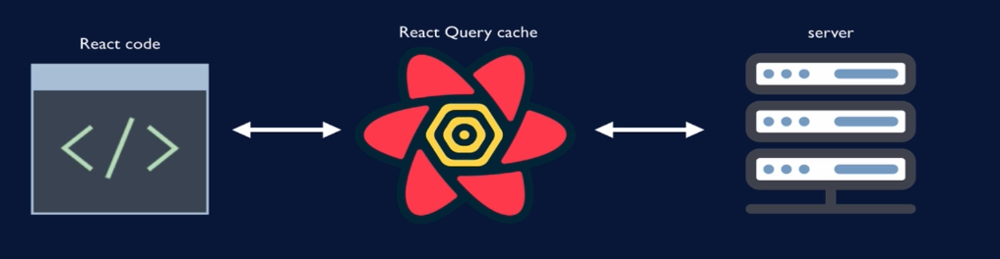

    
    <h1> React-TypeScript Boilerplate App </h1>

This repository was created with the intention of providing developers with a
starter app to kick-off their Front-End Projects using React-TypeScript.

# Development Tooling

### Testing Tools:

1. [Vitest](https://vitest.dev/)
2. [Jest DOM](https://github.com/testing-library/jest-dom)
3. [React Testing Library](https://testing-library.com/docs/react-testing-library/intro)

### Documentation Standard

1. [TSDoc](https://tsdoc.org/)

# How to use it

1. Install pnpm globally in your machine. ([See the official docs](https://pnpm.io/installation))
2. Execute `pnpm run ci` to perform the instalation of all dependencies. (Read [this reference](https://betterprogramming.pub/npm-ci-vs-npm-install-which-should-you-use-in-your-node-js-projects-51e07cb71e26) for more details)
3. Execute `pnpm run dev`, and immediately you will see the vite server running.

# Development Pattern

    

# Table Of Content

1. [What is React Query?](#what-is-react-query)
2. [Client State vs Server State](#client-state-vs-server-state)
3. [What problem does React Query solve?](#what-problem-does-react-query-solve)

## What is React Query?

Library that manages server state for your React app.

## Client State vs Server State

 - Client State: Information relevant to the web browser session.
    Example: User's chosen language or theme.

 - Server State: Information stored on the server.
    Example: Blog post data from database.

## What problem does React Query solve?

React Query maintains cache of server data on client. So the way it looks is:

    

when your React Code needs data from the server, it doesn't go straight to the
server. Instead, it asks the React Query Cache since it is the source of truth for
the server data. And its job is to maintain the maintain the data in that cache
based on a certain configuration.

So, React Query manages the data and it is your job to indicate when you want to
update the cache with new data from the server. You can do it

1. Imperatively: You manually trigger the action.
2. Declaratively: You can configure it (e.g. window docus) & when to trigger
a re-fetch automatically with staleTime (see docs)

React Query comes with a lot of other tools to help you with you server state
management

1. It _maintains loading and error states for every query to the server_ so
that you don't have to do it manually.
2. It _gives you tools to fetch data in pieces just when its needed by the user_
for pagination of the data or an infinite scroll.
3. You can _pre-fetch data if you anticipate that the user is going to need it_.
So you can pre-fetch the data, put it in the cache, and then when the user does
need the data your app can draw it from the cache and the user doesn't have to
wait for you to contact the server.
4. It _can also manage mutations or updates of data on the server_.
5. Since queries are identified by a key, React Query can manage your requests
so that if you load a page and several components on that page request the same
data React Query can send the request only once and if another component requests
the data while that original query is going out, then React Query can de-duplicate
the requests.
6. React Query can also manage you retries if you get an error from the server.
7. It provides callbacks so you can take actions if your query is succesfull, if
it returns an error, or you can provide a callback to take an action in either case.